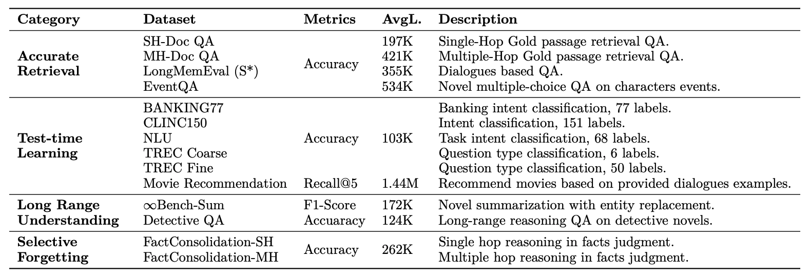

# 論文筆記：MemoryAgentBench

**標題：** Evaluating Memory in LLM Agents via Incremental Multi-Turn Interactions
**作者：** Yuanzhe Hu, Yu Wang, Julian McAuley（UC San Diego）
**發表：** ICLR 2026 | arXiv:2507.05257
**論文連結：** https://arxiv.org/pdf/2507.05257

---

## 問題與動機

現有 LLM agent benchmark（GAIA, SWE-Bench 等）聚焦於推理、規劃、工具使用，對**記憶能力**的評估幾乎付之闕如。

現有記憶相關 benchmark 的缺陷：
- 早期 benchmark（LOCOMO、LooGLE）context 過短（~5k–24k tokens），不足以挑戰現代模型
- 近期長文本 benchmark（NovelQA、∞-Bench）設計用於靜態單次閱讀，不適合增量式 memory agent
- 最關鍵的差異：**memory 是對過去資訊的壓縮與抽象**，而非逐字儲存——靜態全文輸入無法評估這個特性
- 現有 benchmark 沒有一個同時涵蓋四種記憶能力

---

## 核心貢獻

1. **MemoryAgentBench**：將現有長文本資料集轉為增量多輪格式，並新增兩個資料集。共 2,071 題，context 深度 103k–1.44M tokens。
2. **四種記憶能力框架**（基於認知科學）
3. **兩個新資料集**：EventQA（事件時序推理）、FactConsolidation（選擇性遺忘）
4. **統一評估框架**：開源，涵蓋 Long-Context、RAG、Agentic Memory 三類架構

---

## 四種記憶能力

| 能力 | 定義 |
|------|------|
| **Accurate Retrieval (AR)** | 從長對話歷史中精確取出相關片段（單跳/多跳） |
| **Test-Time Learning (TTL)** | 部署期間從對話脈絡習得新行為或技能（無需重新訓練） |
| **Long-Range Understanding (LRU)** | 整合分散在超長 context（≥100k tokens）中的資訊 |
| **Selective Forgetting (SF)** | 當出現矛盾資訊時，修正或覆蓋舊記憶 |

---

## 資料集情境

MemoryAgentBench 不採用單一情境，而是以**多種異質情境**涵蓋不同記憶能力，各資料集對應不同的現實使用場景：

| 資料集 | 情境描述 |
|--------|---------|
| **SH/MH-Doc QA** | Agent 依序閱讀大量文件片段（如知識庫、報告），事後回答關於文件內容的問題 |
| **LongMemEval (S*)** | Agent 與使用者進行長期多 session 對話，需記住歷史對話中提及的個人資訊 |
| **EventQA** | Agent 依序閱讀長篇小說，追蹤各角色的事件發展與時序 |
| **BANKING77 / CLINC150 / NLU / TREC** | Agent 從歷史範例中學習意圖分類規則，模擬客服系統從示範案例習得分類能力 |
| **Movie Recommendation** | Agent 從長期對話歷史中學習使用者電影偏好，並在新對話中給出個人化推薦 |
| **∞Bench-Sum** | Agent 閱讀完整長篇小說後進行摘要，需整合全書脈絡 |
| **Detective QA** | Agent 閱讀偵探小說，需整合分散各處的線索進行推理 |
| **FactConsolidation** | Agent 接收一系列知識更新（舊事實被新事實覆蓋），需識別最新版本並捨棄過時資訊 |

### 共同的互動協議
所有資料集均採用統一的**增量多輪格式**：
1. Agent 逐塊接收資訊片段，每塊附帶「請記住，之後會提問」的指令
2. 所有片段輸入完畢後，才開始問答階段
3. 模擬真實記憶 agent 的工作方式（邊累積邊壓縮，而非一次性讀取全文）

> **一句話情境**：涵蓋文件閱讀、長期對話、小說理解、客服學習、個人化推薦等多種場景，統一評估 agent 在增量資訊輸入下的記憶管理能力。

---

## Benchmark 資料集設計

| 能力 | 資料集 | 平均 Context 長度 | 說明 |
|------|--------|-----------------|------|
| AR | SH-Doc QA | 197K | 單跳文件 QA |
| AR | MH-Doc QA | 421K | 多跳文件 QA |
| AR | LongMemEval (S*) | 355K | 對話式 QA |
| AR | **EventQA（新）** | 534K | 小說角色事件多選題 |
| TTL | BANKING77/CLINC150/NLU/TREC | 103K | 意圖分類 |
| TTL | Movie Recommendation | 1.44M | 電影推薦（Recall@5） |
| LRU | ∞Bench-Sum | 172K | 小說摘要 |
| LRU | Detective QA | 124K | 偵探小說長程推理 |
| SF | **FactConsolidation-SH（新）** | 262K | 單跳事實更新 |
| SF | **FactConsolidation-MH（新）** | 262K | 多跳事實更新 |

### EventQA 建構方式
- 使用 5 本 ∞-Bench 書籍（各 >390K tokens）
- SpaCy NER 取出前 10 個高頻角色
- GPT-4o 為每位角色提取 101 個事件，每個事件生成 6 選 1 多選題（1 個正確 + 5 個 GPT-4o 產生的干擾項）

### FactConsolidation 建構方式
- 基於 MQUAKE 反事實編輯對（真實事實 + 改寫後矛盾版本）
- 新事實序號永遠大於舊事實，agent 須以「序號越大越新」原則判斷
- 長度梯度：6K、32K、64K、262K tokens

---

## 三類 Agent 架構

| 類型 | 代表 |
|------|------|
| **Long-Context Agents** | GPT-4o, GPT-4.1-mini, Claude-3.7-Sonnet, Gemini-2.0-Flash |
| **RAG Agents** | BM25, Contriever, Text-Embed-3, HippoRAG-v2, RAPTOR, GraphRAG, Mem0, Cognee, Zep |
| **Agentic Memory Agents** | Self-RAG, MemGPT, MIRIX（六種專屬記憶類型） |

---

## 評估指標
 

---

## 主要實驗結果

### 三大發現

**發現一：RAG 在精確取回（AR）上最強**
- HippoRAG-v2 達 65.1% AR，優於 GPT-4o-mini（49.2%）
- RAG 擅長定位小片段，但無法掌握全域資訊

**發現二：Long-Context 在 TTL 和 LRU 上最強**
- Claude-3.7-Sonnet LRU 達 62.2%，Mem0 僅 20.7%
- RAG 只取回部分資訊，無法做到真正的「學習」或「整體理解」

**發現三：Selective Forgetting 是所有方法的死穴**
- 多跳 SF（FC-MH）最高只有 7%
- 即使是強推理模型（o4-mini），超過 32K tokens 後 MH-SF 從 80% 暴跌至 14%
- 單靠 prompt engineering 無法解決（Policy A/B 均失敗）

### 代表性分數（Overall 平均）

| Agent | Overall |
|-------|---------|
| Claude-3.7-Sonnet | **49.6%** |
| GPT-4o | 48.8% |
| GPT-4.1-mini | 46.9% |
| HippoRAG-v2 | 41.6% |
| BM25 | 41.5% |
| Mem0 | 21.1% |
| Cognee | 20.6% |

### 成本效益亮點（MH-Doc QA）

| 方法 | 成本 | 效能 |
|------|------|------|
| GPT-4o-mini（直接） | $0.010 | 43.0% |
| BM25 + 4o-mini | <$0.001 | 56.0% |
| MIRIX（4.1-mini） | $0.016 | **75.0%** |
| GPT-4.1-mini（直接） | $0.043 | 66.0% |

→ MIRIX 同時達到最高效能與合理成本，顯示 agentic memory 可以打破「效能 ∝ context 長度 ∝ 成本」的線性關係。

---

## 重要消融實驗

- **chunk size**：越小對 AR 有利（精度），越大對 LRU 有利（全域整合），兩者本質衝突
- **Top-K**：增加 K 一般有益，但也快速膨脹輸入 token 數
- **backbone**：RAG 方法在 backbone 夠強後瓶頸不在 backbone；agentic 方法受益明顯更大（+9.7 avg points）
- **商業 agentic 系統（Mem0、Cognee、Zep）**：即使在短 context 下也持續低於各自 backbone——複雜度未帶來效能提升

---

## 結論與啟示

- 目前沒有任何方法同時掌握四種記憶能力
- **Selective Forgetting** 是最開放、最迫切的研究挑戰
- 商業 memory agent 的實際效果遠不如宣稱的那麼強
- 更強的 backbone 對 agentic 架構的提升比對 RAG 更顯著

**Artifacts：** 程式碼（MIT License）、資料集（CC BY 4.0）
